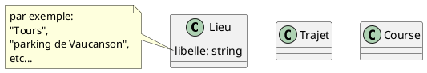

# Vraie vie

plusieurs **Personnes** font du covoiturage:

- pour faire un **Trajet** entre un **point de départ** et un **point d'arrivée** 
- les points de départ et d'arrivée ont un nom, genre "Parking du Leclerc" et "Ma petite entreprise"
- pour le trajet il y a une heure de départ
- une durée estimée aussi ? => heure estimée d'arrivée ?
- les **Personnes** ont un **Rôle**:  **Conducteur** ou **Passagers**
- y a aussi une **Bagnole**: en général c'est celle du conducteur
- le trajet fait un certain nombre de **kilomètres**
- distinguer entre un **Trajet** prévu, qui change pas, et le trajet réel:
    - qui se fait un jour donné, à une date donnée, a une heure de départ et d'arrivée => copier sur Waze
    - le trajet c'est une classe, et y a des instances de trajet

